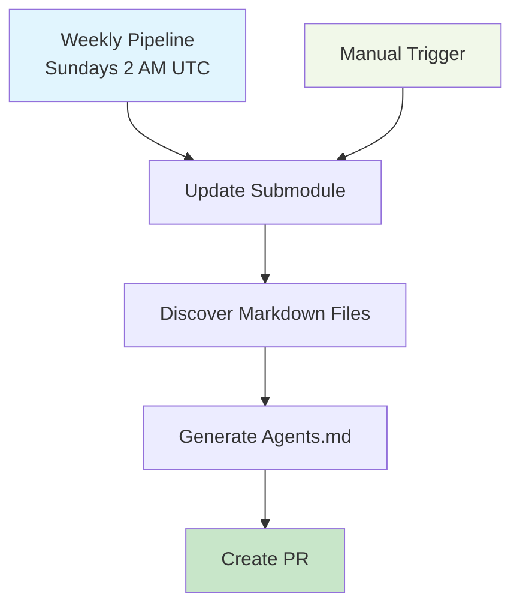

# Surge Coding Standards

Automated Drupal coding standards documentation with AI-powered Agents.md generation from GitLab repository.

> Part of the [Drupal Surge](https://www.drupal.org/project/surge) ecosystem - giving AI tools a sense of Drupal.

## Features

- **Direct Repository Access**: Uses [Drupal Coding Standards](https://git.drupalcode.org/project/coding_standards) GitLab repository as git submodule
- **Smart Caching**: Only processes changed files using content hash comparison
- **AI Processing**: Converts markdown documentation directly to Agents.md
- **Automated Pipeline**: Weekly GitHub Actions workflow with PR-based updates
- **GitHub Pages**: Deployed documentation site

## Setup

1. **Install dependencies**:
   ```bash
   npm install
   ```

2. **Initialize submodule** (if not already done):
   ```bash
   git submodule update --init --recursive
   ```

3. **Configure GitHub secrets**:
   - `PAT_GITHUB_TOKEN`: PAT token for repository access
   - `OPENAI_API_KEY`: OpenAI API key for AI processing

4. **Run locally**:
   ```bash
   npm run full-pipeline
   ```

## How It Works



**Pipeline Steps:**
1. **Update Submodule** - Pulls latest changes from coding_standards repository
2. **Discover Files** - Scans repository for markdown files and builds manifest
3. **Generate Agents.md** - Processes markdown files with AI (only changed files)
4. **Create PR** - Single PR with all changes for review

## Project Structure

```
├── .github/workflows/        # GitHub Actions
├── data/                     # Generated content
│   ├── coding_standards/    # Git submodule (Drupal coding standards repo)
│   ├── repo-manifest.json   # File manifest with hashes and metadata
│   └── agents-cache.json    # Cache of AI-processed content
├── scripts/                  # Automation scripts
│   ├── repo-file-discoverer.js  # Discovers markdown files
│   └── markdown-to-agents.js   # Generates Agents.md
├── docs/Agents.md           # Final documentation
└── package.json
```

## Automation

- **Weekly**: Runs automatically every Sunday at 2 AM UTC
- **Manual**: Trigger via GitHub Actions UI
- **PR-Based**: All changes go through PR review
- **Smart Caching**: Only processes changed files using content hash comparison

## Content Hashing & Caching

The system uses SHA-256 content hashing to detect actual content changes. Only files with changed content hashes are processed with AI, while unchanged files are loaded from cache. This ensures:
- **Efficient updates**: Minimal AI API calls
- **Cost effective**: Only process what changed
- **Fast execution**: Reuse cached results

## Source Repository

This project uses the official [Drupal Coding Standards](https://git.drupalcode.org/project/coding_standards) repository as a git submodule. The repository contains markdown documentation files that are processed to generate the Agents.md file.

## Links

- [Generated Documentation](./docs/Agents.md)
- [Drupal Surge Project](https://www.drupal.org/project/surge)
- [Drupal Coding Standards Repository](https://git.drupalcode.org/project/coding_standards)
