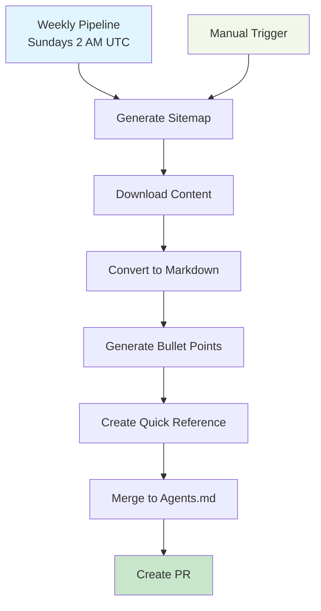

# Surge Coding Standards

Automated Drupal coding standards documentation with AI-powered Agents.md generation.

> Part of the [Drupal Surge](https://www.drupal.org/project/surge) ecosystem - giving AI tools a sense of Drupal.

## 🚀 Features

- **Smart Downloads**: Only downloads changed content using timestamps
- **AI Processing**: Converts documentation to structured bullet points and Agents.md
- **Automated Pipeline**: Weekly GitHub Actions workflow with PR-based updates
- **GitHub Pages**: Deployed documentation site

## 🔧 Setup

1. **Install dependencies**:
   ```bash
   npm install
   ```

2. **Configure GitHub secrets**:
   - `PAT_GITHUB_TOKEN`: PAT token for repository access
   - `OPENAI_API_KEY`: OpenAI API key for AI processing

3. **Run locally**:
   ```bash
   npm run full-pipeline
   ```

## 🔄 How It Works



**Pipeline Steps:**
1. **Sitemap Generation** - Downloads Drupal docs and extracts timestamps
2. **Smart Download** - Only downloads changed content
3. **HTML to Markdown** - Converts to clean markdown
4. **AI Bullet Points** - Generates structured content for AI tools
5. **Quick Reference** - Creates page-specific AI prompts
6. **Agents.md** - Merges everything into comprehensive documentation
7. **PR Creation** - Single PR with all changes for review

## 📁 Project Structure

```
├── .github/workflows/     # GitHub Actions
├── data/                  # Generated content
│   ├── sitemap.json      # Documentation links with timestamps
│   ├── downloads/        # Downloaded HTML files
│   ├── markdown/         # Converted markdown
│   ├── bullets/          # AI bullet points
│   └── pages/            # Quick Reference pages
├── scripts/              # Automation scripts
├── docs/Agents.md        # Final documentation
└── package.json
```

## 🤖 Automation

- **Weekly**: Runs automatically every Sunday at 2 AM UTC
- **Manual**: Trigger via GitHub Actions UI
- **PR-Based**: All changes go through PR review
- **Smart Updates**: Only processes changed content

## 🔗 Links

- [Generated Documentation](./docs/Agents.md)
- [Drupal Surge Project](https://www.drupal.org/project/surge)
- [Drupal Official Docs](https://www.drupal.org/docs/develop/standards)

## 📝 License

MIT License