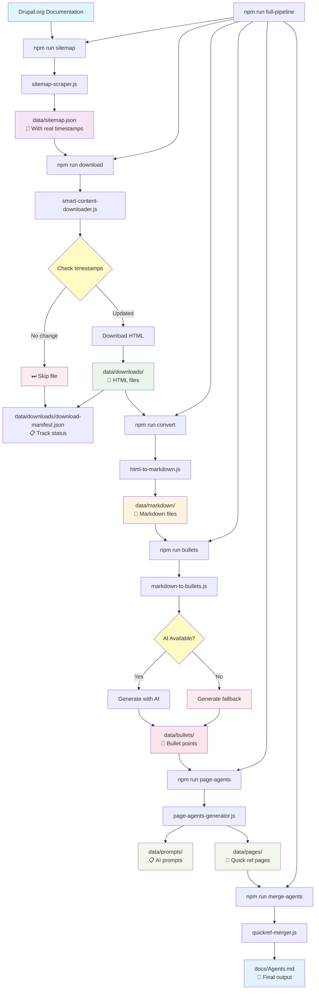
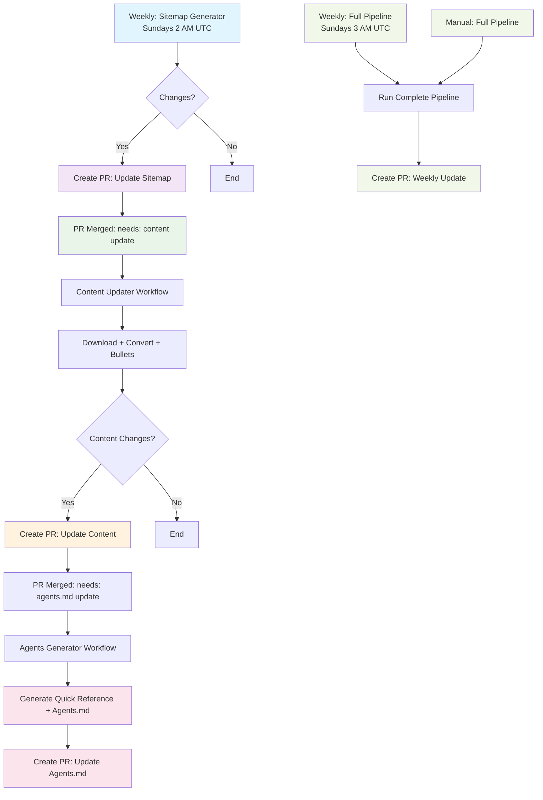

# Surge Coding Standards

An automated system that downloads Drupal coding standards documentation, converts it to structured content, and generates comprehensive `Agents.md` files using AI assistance, with GitHub Pages integration for a custom documentation site.

> Part of the [Drupal Surge](https://www.drupal.org/project/surge) ecosystem - giving AI tools a sense of Drupal.

## 🎯 Project Goals

- Automatically download and track Drupal coding standards documentation changes
- Generate structured sitemap with real last updated dates
- Convert HTML documentation to markdown and bullet points
- Use AI to generate comprehensive `Agents.md` file from real documentation content
- Deploy results to GitHub Pages

## 🚀 Features

- **Smart Content Download**: Downloads Drupal documentation locally, so we dont have to always scrape Drupal.org
- **Timestamp-Based Updates**: Only downloads content when it has actually changed
- **HTML to Markdown Conversion**: Converts downloaded HTML to clean markdown
- **AI-Powered Bullet Points**: Converts documentation to structured bullet points
- **Comprehensive Agents.md**: Generates professional documentation for AI tools
- **GitHub Actions**: Fully automated CI/CD pipeline
- **GitHub Pages**: Beautiful static site deployment

## 📁 Project Structure

```
/
├── .github/workflows/     # GitHub Actions workflows
├── data/                  # Generated data
│   ├── sitemap.json      # Generated sitemap with real dates
│   ├── downloads/        # Downloaded HTML files + manifest
│   ├── markdown/         # Converted markdown files
│   ├── bullets/          # AI-generated bullet points
│   ├── pages/            # Quick Reference pages
│   └── prompts/          # AI prompts for Quick Reference
├── scripts/              # Automation scripts
│   ├── sitemap-scraper.js           # Generate sitemap with timestamps
│   ├── smart-content-downloader.js  # Smart download with timestamp checking
│   ├── html-to-markdown.js          # Convert HTML to markdown
│   ├── markdown-to-bullets.js       # Generate bullet points
│   ├── page-agents-generator.js     # Generate Quick Reference pages
│   └── quickref-merger.js           # Merge Quick Reference pages
├── docs/                 # Generated documentation
│   └── Agents.md
└── package.json          # Dependencies
```

## 🔧 Setup

1. **Install dependencies**:
   ```bash
   npm install
   ```

2. **Configure GitHub secrets**:
   - `PAT_GITHUB_TOKEN`: PAT token for repository access
   - `OPENAI_API_KEY`: OpenAI API key for ChatGPT integration

3. **Run locally**:
   ```bash
   # Generate sitemap
   npm run sitemap

   # Download content
   npm run download

   # Convert HTML to markdown
   npm run convert

   # Generate bullet points (needs API key)
   npm run bullets

   # Generate Quick Reference pages (needs API key)
   npm run page-agents

   # Merge Quick Reference pages into final Agents.md
   npm run merge-agents

   # Run complete pipeline
   npm run full-pipeline
   ```

## 🔄 Processing Pipeline

The system processes Drupal documentation through a sophisticated pipeline with intelligent timestamp-based updates:



### 🕒 Smart Timestamp-Based Updates
- **Intelligent Download**: Only downloads files that have actually changed based on real timestamps from Drupal.org
- **Manifest Tracking**: Maintains download history and metadata to avoid redundant work
- **Skip Logic**: Automatically skips unchanged files, saving bandwidth and processing time
- **Cost Optimization**: Minimizes AI token usage by focusing on bullet points only

The system processes Drupal documentation through a sophisticated pipeline:

### Step 1: Sitemap Generation (`npm run sitemap`)
- Downloads the main Drupal coding standards page
- Extracts all documentation links organized by category
- Fetches real last updated dates for each page
- Creates structured JSON sitemap with timestamps

### Step 2: Smart Content Download (`npm run download`)
- download Drupal documentation so we don't keep scraping

### Step 3: HTML to Markdown Conversion (`npm run convert`)
- Converts downloaded HTML files to clean markdown

### Step 4: Bullet Points Generation (`npm run bullets`)
- Convert markdown documentation to structured bullet points
- Focuses on rules, guidelines, and standards for AI tools
- Creates comprehensive bullet points for each documentation area

### Step 5: Quick Reference Generation (`npm run page-agents`)
- Creates page-specific AI prompts based on the bullet points
- Focuses on essential rules and guidelines only
- Token-cost optimized with bullet points only

### Step 6: Final Agents.md Generation (`npm run merge-agents`)
- Merges all Quick Reference pages into comprehensive Agents.md file

## 🕒 Timestamp-Based Update Logic

The system intelligently skips unnecessary downloads and processing:

### Smart Download Logic
```javascript
// Check if file needs update
if (fileInfo.lastUpdated !== lastUpdated) {
  return true; // Updated timestamp - download needed
}
if (!fileInfo.downloadedAt || !await fileExists(filePath)) {
  return true; // New file - download needed
}
return false; // No update needed - skip
```

### Benefits
- **Bandwidth Savings**: Only downloads changed content
- **Processing Efficiency**: Skips unchanged files in conversion pipeline
- **Cost Optimization**: Reduces AI token usage for unchanged content
- **Faster Updates**: Quick incremental updates instead of full rebuilds

## 🤖 Automation

The system runs automatically via GitHub Actions with a sophisticated PR-based workflow structure:



### Workflow Details:

1. **Weekly Sitemap Generation** (Sundays 2 AM UTC) - Downloads main page and extracts all links with real last updated dates, creates PR
2. **Content Update Workflow** - Triggers when sitemap PR is merged, downloads changed content and creates PR
3. **Agents Generation Workflow** - Triggers when content PR is merged, generates Agents.md and creates PR
4. **Weekly Full Pipeline** (Sundays 3 AM UTC) - Complete system update, creates PR
5. **Manual Triggers** - All workflows can be triggered manually
6. **PR-Based Flow** - All changes go through PR review before merging to main 

## 📊 Status

- [x] Repository setup
- [x] GitHub Actions workflows
- [x] Sitemap generation (curl-based)
- [x] Smart content download with robust techniques
- [x] HTML to markdown conversion
- [x] AI-powered bullet points generation
- [x] Comprehensive Agents.md generation
- [x] Timestamp-based update checking
- [x] Fallback content generation
- [X] GitHub Pages deployment

## 🤖 Drupal Surge Integration

This project is part of the [Drupal Surge](https://www.drupal.org/project/surge) ecosystem, which aims to give AI tools a sense of Drupal and ensure diverse setups shape the context needed to guide AI to write for, and work with Drupal.

### AGENTS.md Standard

The generated `Agents.md` file follows the emerging AGENTS.md standard used by 20k+ open-source projects and works with modern AI-powered development tools including:

- **Cursor** - Modern AI-powered code editor
- **Claude** - Anthropic's AI assistant  
- **Codex** - OpenAI's code generation model
- **Amp, Jules, Factory, RooCode** - And 10+ other modern agents

### How It Works

1. **Smart Content Download**: Downloads Drupal develop documentation
2. **Content Processing**: Converts HTML to markdown and generates structured bullet points
3. **Prompts**: Generates individual prompts per section, to circumvent API limits
4. **AI Processing**: ChatGPT generates comprehensive Agents.md file from real documentation

### Performance Optimizations
- **Timestamp Checking**: Only downloads content when it has actually changed
- **Content Tracking**: Maintains download history to avoid redundant work
- **Fallback Systems**: Graceful degradation when AI services are unavailable

### Data Flow
```
Drupal.org → Sitemap → Smart Download → HTML → Markdown → Bullets → Agents.md
     ↓           ↓            ↓          ↓        ↓         ↓         ↓
  34 pages   11 sections   33 files   33 files  33 files  33 files  1 file
```

## 🔗 Links

- [Project Plan](./PROJECT_PLAN.md)
- [Generated Documentation](./docs/Agents.md)
- [Drupal Surge Project](https://www.drupal.org/project/surge)
- [Drupal Official Docs](https://www.drupal.org/docs/develop/standards)

## 📝 License

MIT License - see LICENSE file for details.
